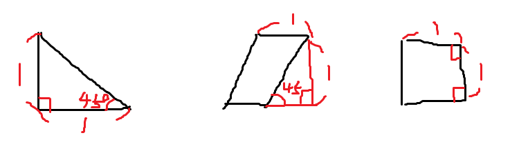

#

眾所皆知，如果所有帳號共用同一組密碼，一旦被盜就是全滅。
如果所有帳號都使用不同密碼，很快就會忘光；
寫在紙上貼螢幕上只會加速滅亡。

學過演算法的 llc 很快想到一招：何不利用 hash？
沒錯，只要把帳號『用在哪個地方』拿來 hash 就能得到不同密碼！
而且規則很難破解，但永遠只需要記一組規則。
llc 決定將其命名為《lolihash 大法》！

例如用在 TOJ 的密碼，就將 `TOJ` 扔進 hash；
用在 UVa 的密碼，就將 U.. 啊，UVa 已經不叫 UVa 了。
......
沒、沒關係，密碼是可以修改的！！

很快地，llc 已經完成了《lolihash 大法》的 code，
可以將任意字串轉成 mod 1000000007 後的整數，
沒錯，llc 只接受整數！
但更快地，有些囉嗦嘮叨的網站要求每 16 天要換一次密碼，真是麻煩。
加上有些重要網站綁有魔法卡，llc 希望有一套追加規則來處理密碼的再加密。

於是熱愛 math 的 llc 設定了一道 math 題，可以將 hash 後的數字作為輸入，
把計算結果 mod 1000000007 作為輸出，
這樣自己的輸出可以再作為自己的輸入再次加密！
最後只要在密碼提示寫上再加密次數即可。llc 真他媽天才！！

llc 決定就將其命名為《logichash 大法》！！
（lolihash + 積木 => 蘿莉積木雜湊 => 蘿姬雜湊 => logichash）
並且將題目藏到大海中，準備開啟大海賊時代。
附帶一提，方法是漂流瓶。

不過為了分散風險，llc 決定不自己寫這道 math 的 code，
將這份重責大任交給足以託付背後的你，並且不打算將 code 放自己身邊。
再加密的自產自食部份 llc 已經完成，你只需要幫忙完成 math 的部份。

你收到的題目如下：

你擁有三種種類的積木：
- 邊長 1 正方形
- 短邊長 1 等腰直角三角形
- 底邊長 1 角度為 45/135 度的平行四邊形



求有多少種不同方式，拼成高 1 底 n 的長方形？

噢，別忘了幫 llc 保密。

### 輸入
輸入僅有一正整數 n

### 輸出
輸出方法數 mod 1000000007

### 範圍
$0 < n \le 1000000007$

### 子任務
| 編號 | 分數 | 限制 |
| --- | -------- | -------- |
|1|10|$n \le 7$|
|2|20|$n \le 10^3$|
|3|30|$n \le 10^6$|
|4|40|無額外限制|

### 範例輸入1
```
1
```

### 範例輸出1
```
3
```

### 範例輸入2
```
2
```

### 範例輸出2
```
11
```
