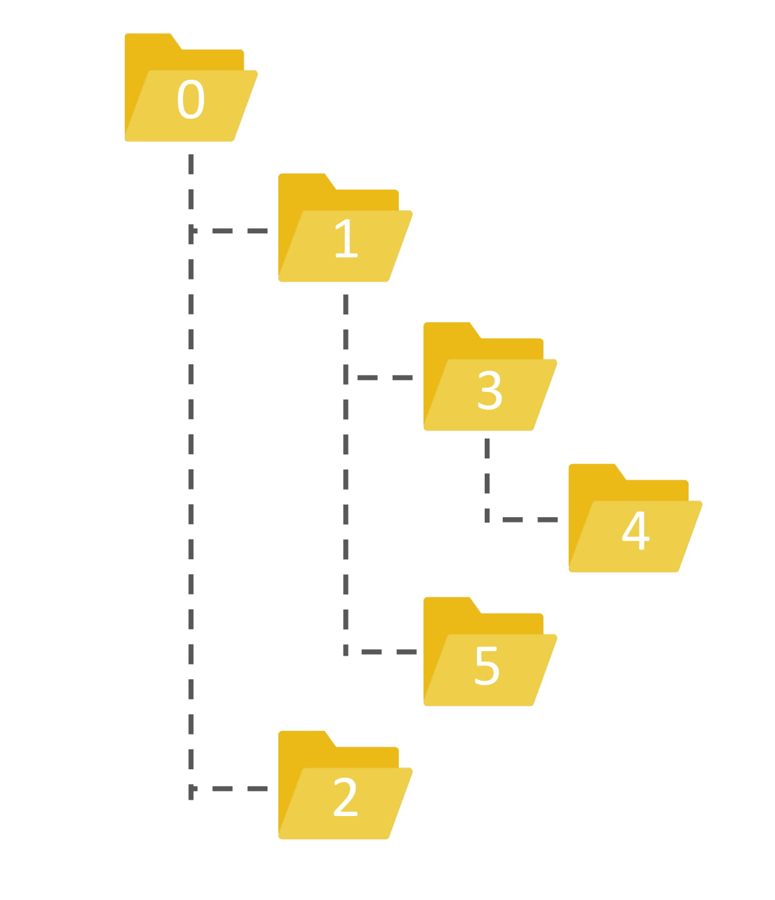

#

ub33 是個蘿莉控，他非常喜歡蘿莉，所以他趁著去日本旅行的時候拍了很多蘿莉回家欣賞。  
而他的好朋友 ub44 也是個蘿莉控，俗話說「好東西要跟好朋友分享」，所以一起分享蘿莉的照片也是很重要的，像是ub33 去日本拍蘿莉，而 ub44 去韓國拍蘿莉，兩個人再互相分享，這樣就能輕輕鬆鬆看到很多蘿莉，大飽眼福了。  
不過這麼多照片如果用隨身碟傳輸實在太麻煩了，更何況 ub33 住在台南，而 ub44 住在台北，所以他們使用了 geegle 雲端硬碟來互相分享檔案。  
有些蘿莉實在太珍貴了，ub33 想要獨享，他只想分享一些給 ub44。而且 ub33 很懶惰，他覺得要一張一張照片設訂共用實在太麻煩了，因此他只想要選擇一個資料夾設定共用，來讓他想分享的所有照片都被共用。  
geegle 雲端硬碟的設計是，只要一個資料夾被共用，他底下的所有資料夾跟檔案全部都會跟著被共用，不管是底下幾層都一樣。  
可是 ub33 也不想要設定了一個資料夾共用之後，有太多其他的檔案被看見，所以他希望設定的這個資料夾底下包含的檔案跟資料夾越少越好，可是還是要包含所有他要共用的檔案。  
你能幫他找到他該設定哪個資料夾嗎？  
如果你幫他找出來，除了給你分數之外，他搞不好還能給你一張他珍藏的蘿莉照片喔！  

### 輸入
第一行兩個數字 $n$、$q$，代表總共有 $n$ 個檔案或資料夾，以及有 $q$ 筆詢問。  
第二行有 $n-1$ 個數字，代表每個檔案或資料夾的上一層是哪個資料夾，從編號 $1$ 的開始，因為編號 $0$ 是根資料夾。  
再來有 $q$ 行，每行代表一筆詢問，每行剛開始有一個數字 $x$ ，再來有 $x$ 個數字 $f_{i}$ ，每個 $f_i$之間以空白隔開，代表有哪些編號的檔案或資料夾要共用。  
編號 $0$ 的資料夾是根資料夾。  

### 輸出
輸出 $q$ 行，代表對於每筆詢問要將哪個資料夾設成共用。  

### 輸入限制
* $1 \leq n \leq 10^6$
* $1 \leq q \leq 100$
* $1 \leq x \leq 100$

### 子任務
| 編號 | 分數 | 限制 |
| --- | -------- | -------- |
|1|19|$x$ = 2|
|2|19|$q = 1$|
|3|11|所有資料夾底下最多只有一個資料夾或檔案|
|4|7|對於每筆詢問，所有要共用的檔案的上一層資料夾都相同|
|5|17|$n \leq 100$|
|6|27|無額外限制|

### 範例輸入
```
6 7
0 0 1 3 1
3 4 5 2
2 3 2
2 4 3
2 4 5
3 4 3 5
1 1
1 4
```
### 範例輸出
```
0
0
3
1
1
1
4
```
