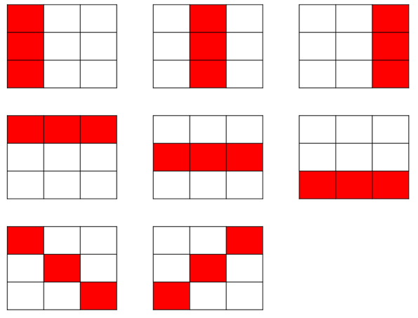

#


<center>這是梨善。如果你沒看過，現在給你看。然而這和本題一點關係都沒有</center>

---

給定 $n*m$ 的網格圖（Grid），問有多少種選 $k$ 個相異格子，且剛好形成一條連線的選法。
形成一條連線，表示可以用一條直線劃過所有格子，直線可以是縱、橫或斜的，且格子兩兩一定要都共用一條邊或都共用一個角（點）。

以 $3*3$ 的網格圖，選 $3$ 個相異格子為例（$n=3，m=3，k=3$），共有 $8$ 種選法：



本題有 $T$ 筆詢問。
如果你不清楚連線的定義，可以參考**備註**的代數定義。

### 輸入
第一行有一個整數 $T$，表示有 $T$ 筆詢問。
接下來有 $T$ 行，每行有三個整數 $n,m,k$，表示該筆詢問的網格圖高、寬及選擇的格子數量。

### 輸出
對於每筆詢問，輸出一個整數，表示選法數量，接著換行。

### 輸入限制

$1\leq T\leq 50$
所有詢問的 $2\leq n,m,k\leq 10^5$

### 子任務


|編號| 分數 | 限制 |
|---| -------- | -------- |
|1|9|所有詢問的 $n=m=k=2$ 且 $T=1$|
|2|11|所有詢問的 $n=2$ |
|3|20|所有詢問的 $2\leq n,m\leq 5$ |
|4|29|所有詢問的 $2\leq n,m\leq 40$ |
|5|31|無額外限制|

### 範例輸入
```
5
3 3 3
3 3 2
4 4 3
4 2 6
6 9 5
```

### 範例輸出
```
8
20
24
0
68
```

### 備註

要求在 $n*m$ 的網格圖上選 $k$ 個相異格子並形成連線，相當於詢問有多少種相異二元組序列 $(x_1,y_1),(x_2,y_2),(x_3,y_3)...(x_k,y_k)$，滿足以下八個條件：
1. $1\leq x_i\leq n$，對於所有的 $1\leq i\leq k$
2. $1\leq y_i\leq m$，對於所有的 $1\leq i\leq k$
3. $x_i\leq x_{i+1}$，對於所有的 $1\leq i< k$
4. $x_{i+1}-x_i=x_{i+2}-x_{i+1}$，對於所有的 $1\leq i<k-1$
5. $y_{i+1}-y_i=y_{i+2}-y_{i+1}$，對於所有的 $1\leq i<k-1$
6. $x_2-x_1=0$ 或 $x_2-x_1=k$
7. $|y_2-y_1|=0$ 或 $|y_2-y_1|=k$
8. $\max \{x_2-x_1,|y_2-y_1|\}=k$